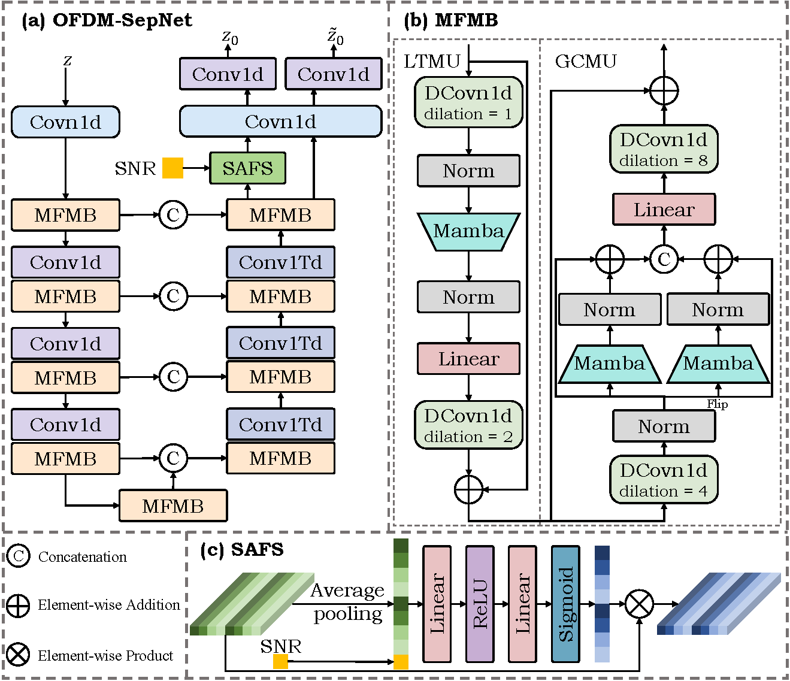
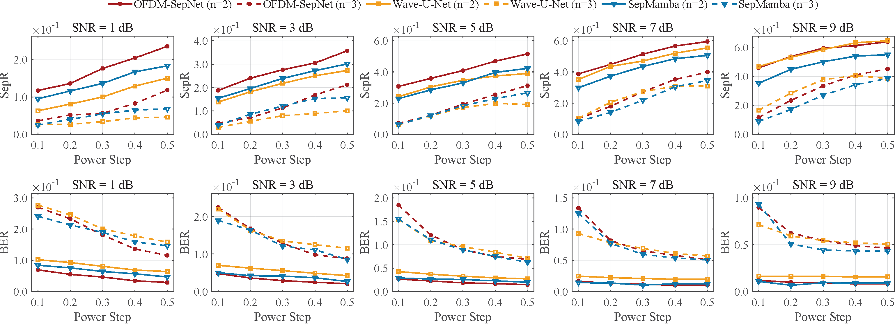
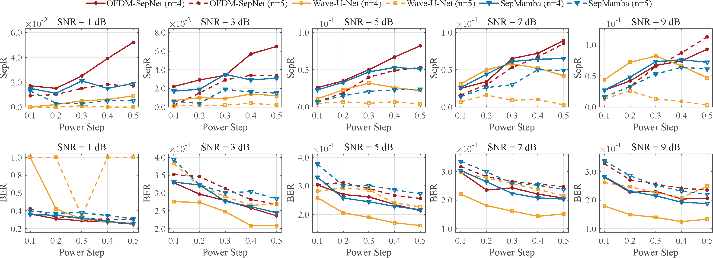
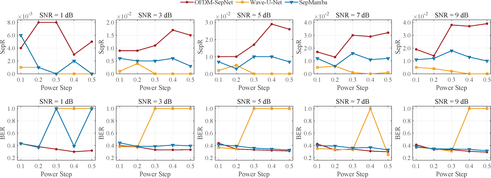

# Deep Learning-based OFDM Symbol Separation for Robust Collision-Resistant UANs
---
**This is the pytorch implementation of paper "Deep Learning-based OFDM Symbol Separation for Robust Collision-Resistant UANs"(updating).**
Underwater Acoustic Networks (UANs) suffer from severe collisions due to extremely limited bandwidth and low signal propagation speed. While traditional collision avoidance strategies degrade performance in dense networks, existing collision recovery techniques require precise channel state information and sophisticated hardware unsuitable for resource-constrained deployments. To address the issue, this paper proposes a novel cross-layer collision-resistant mechanism integrating the MAC and physical layers, named OSPP. It comprises three core modules: an \underline{O}FDM symbol \underline{S}eparation module using the specially-designed deep network OFDM-SepNet, a \underline{P}acket discovery module for accurate frame boundary identification, and a \underline{P}ower control module for optimized transmission power allocation. OFDM-SepNet achieves superior separation performance with low computational complexity (55.35 MB memory and 0.291 GFLOPs) and strong robustness across varying SNR environments. Extensive simulations integrating OSPP with three classical MAC protocols demonstrate significant performance improvements, achieving at least 2× gains in packet delivery ratio, throughput, and energy efficiency compared to baseline protocols.
The architecture of the proposed OFDM-SepNet as shown is follows.


# Requirements
- torch==2.2.0+cu118
- pytorch-lightning==2.5.1.post0
- numpy==1.26.3
- asteroid==0.7.0
- mamba-ssm==1.2.1
- causal-conv1d==1.2.1

# Getting Started
1. Training the OFDM-SepNet model
   ```bash
   python train.py --model OFDM_SepNet --batch_size 512 --file_root your/dataset/path/
   ```
   
   You can also use the pre-trained model directly. Place these models in 'checkpoints/OFDM_SepNet/'.
2. Performing Separation
   ```bash
   python separator.py --model OFDM_SepNet --num_user 2 --coeff_step 0.1 --snr 1.0 --file_root your/dataset/path/
   ```

# Dataset
   ```bash
   python gen_data.py --file_root your/dataset/path/
   ```

  You can also use the pre-generated dataset directly. Place these dataset in 'datasets/train/'.
# Experiments
### Comparison with Wave-U-Net and SepMamba






# State
**Our code is based on [SCSS_OFDMArchitecture](https://github.com/RFChallenge/SCSS_OFDMArchitecture). We are sincerely grateful for the work!**
